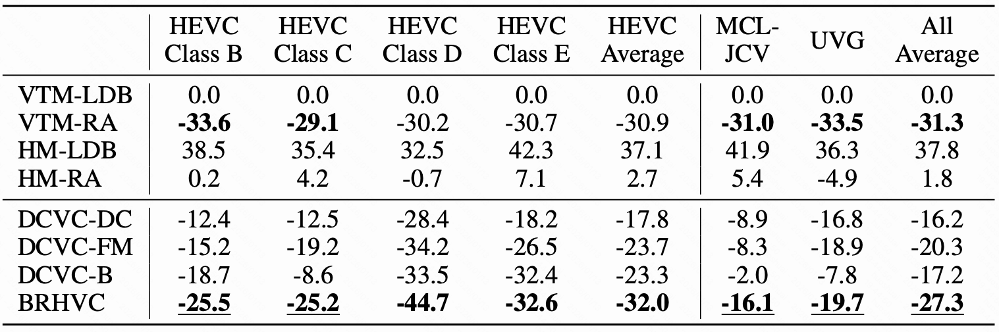
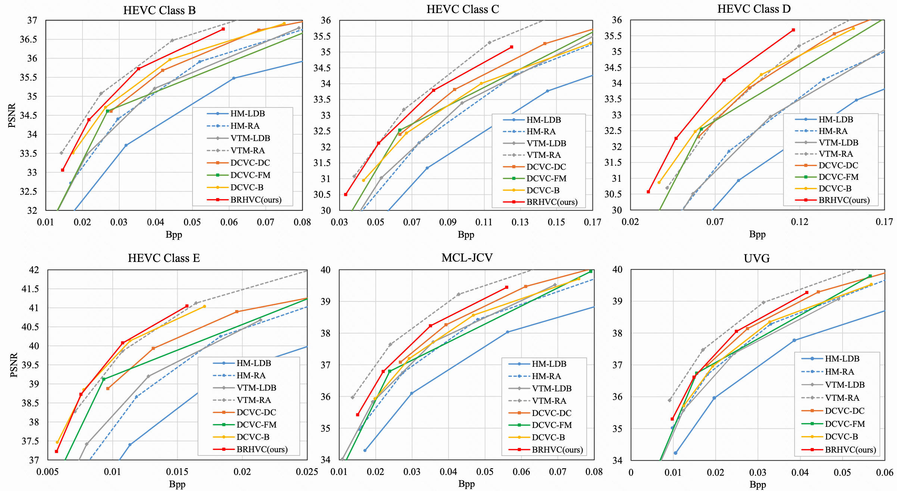

<div align="center">

# 🎉 Neural B-frame Video Compression with Bi-directional Reference Harmonization (NeurIPS 2025)

[](https://neurips.cc/) [](https://arxiv.org/abs/2511.08938)

</div>

---

# 📖 Introduction

We propose **Bi-directional Reference Harmonization Video Compression (BRHVC)**, a novel NBVC method that addresses the challenge of unbalanced reference frame contributions in hierarchical coding with large frame spans. Experimental results indicate that our BRHVC outperforms previous state-of-the-art NVC methods, even surpassing the traditional coding, VTM-RA (under random access configuration), on the HEVC datasets. 
  
# 🛠️ Prerequisites
* Python 3.10 and conda, get [Conda](https://www.anaconda.com/)
* CUDA if want to use GPU
* Environment
    ```
    conda create -n $YOUR_PY_ENV_NAME python=3.10
    conda activate $YOUR_PY_ENV_NAME

    conda install pytorch==2.0.0 torchvision==0.15.0 torchaudio==2.0.0 pytorch-cuda=11.8 -c pytorch -c nvidia
    pip install -r requirements.txt
    ```

# 📊 Test dataset

We use BT.709 conversion matrix to generate png data to test RGB sequences. The dataset structure can be seen in dataset_config_example_rgb.json.

The folder structure of dataset is like:

    /media/data/HEVC_B/
        * BQTerrace_1920x1080_60/
            - im00001.png
            - im00002.png
            - im00003.png
            - ...
        * BasketballDrive_1920x1080_50/
            - im00001.png
            - im00002.png
            - im00003.png
            - ...
        * ...
    /media/data/HEVC_D/
    /media/data/HEVC_C/
    ...

# 🔨 Build the project
Please build the C++ code if want to test with actual bitstream writing. There is minor difference about the bits for calculating the bits using entropy and actual bitstreaming writing. There is overhead when writing the bitstream into the file and the difference percentage depends on the bitstream size. 

## On Linux
```bash
sudo apt-get install cmake g++
cd src
mkdir build
cd build
conda activate $YOUR_PY_ENV_NAME
cmake ../cpp -DCMAKE_BUILD_TYPE=Release
make -j
```

# 📦 Pretrained models

* Our BRHVC uses the same **intra model** as DCVC-DC, which can be downloaded from [DCVC-DC](https://1drv.ms/u/s!AozfVVwtWWYoiWdwDhEkZMIfpon5?e=JcGri5) or by running the script `./checkpoints/download.py`.
* Our inter model can be downloaded using **git-lfs**. Please place the models in the `./checkpoints` folder.

```bash
# Install git-lfs on Linux (if not already installed)
sudo apt-get install git-lfs
git lfs install

# Download models using git-lfs
git lfs pull

# Models will be automatically pulled to ./checkpoints/ if git-lfs is configured
```

# 🚀 Test the models

Example to test pretrained model with four rate points:
```bash
python test_video.py --i_frame_model_path ./checkpoints/cvpr2023_image_psnr.pth.tar --b_frame_model_path ./checkpoints/brhvc_model_weights.pth --rate_num 4 --test_config ./dataset_config_example_rgb.json --cuda 1 --worker 1 --write_stream 0 --output_path output.json --force_intra_period 32 --force_frame_num 97
```

# 📈 Comparing with other method
### 📊 **BD-Rate Comparison**

<div align="center">

*BD-Rate (%) comparison for RGB PSNR. All codecs are under 97 frames with intra-period 32.*



</div>

### 📈 **RD Curve Comparison**

<div align="center">

*RD curve comparison for RGB PSNR.*



</div>

# 🙏 Acknowledgement
The implementation is based on [CompressAI](https://github.com/InterDigitalInc/CompressAI) and [DCVC-DC](https://github.com/microsoft/DCVC/tree/main/DCVC-family/DCVC-DC).
# 📝 Citation
If you find this work useful for your research, please cite:

```
@inproceedings{liu2025brhvc,
  title={Neural B-frame Video Compression with Bi-directional Reference Harmonization},
  author={Yuxi Liu, Dengchao Jin, Shuai Huo, Jiawen Gu, Chao Zhou, Huihui Bai, Ming Lu, Zhan Ma},
  booktitle={Advances in Neural Information Processing Systems},
  year={2025}
}
```
